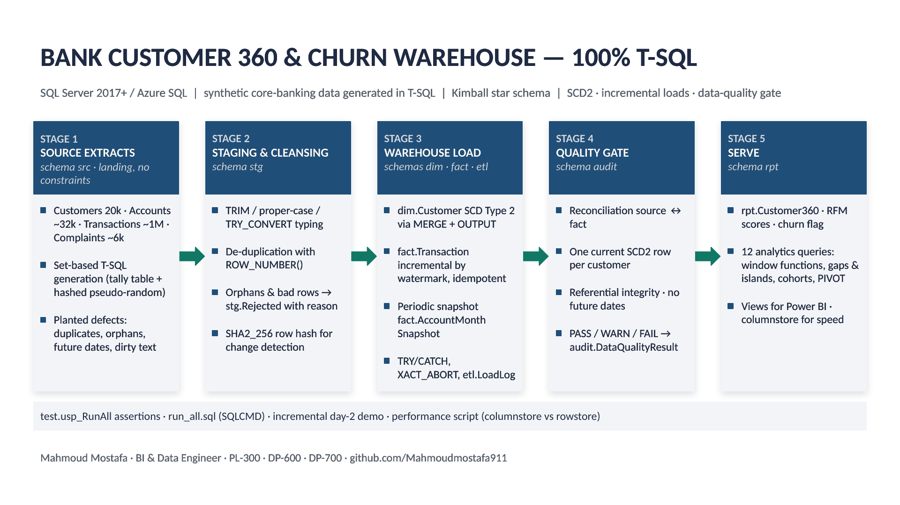

# Bank Customer 360 & Churn Warehouse — 100 % T-SQL

[](https://github.com/Mahmoudmostafa911/bank-customer360-tsql/actions/workflows/ci.yml)
[](sql/)
[](docs/data_model.md)
[](sql/08_tests.sql)
[](LICENSE)

A complete, re-runnable **data-warehouse build written entirely in T-SQL**: synthetic core-banking
extracts → staging & cleansing → Kimball star schema with a Type-2 customer dimension → incremental,
idempotent fact loads → data-quality gate → a **Customer 360** serving table with RFM scores and a churn
flag → 12 analytics queries and 8 Power BI-ready views. Everything runs from one script in SSMS or
`sqlcmd`, a T-SQL test harness verifies the result with 26 assertions, and **GitHub Actions builds the whole
warehouse on a SQL Server 2022 container on every push** (see the badge).



> **About the data.** No real customer data is used anywhere. `02_generate_source_data.sql` generates a
> deterministic synthetic dataset (Egyptian governorates, EGP salaries, realistic channels and merchant
> categories) with **deliberately planted defects** — duplicates, orphans, NULL keys, future dates, dirty
> text — so the cleansing and quality logic has something real to do. Results are reproducible on every run.

---

## Why this project

Banks run on SQL Server. This repository shows the T-SQL patterns a bank's data team uses every day,
in one coherent, end-to-end build rather than as isolated snippets:

| Requirement in the job | Where it is implemented |
|---|---|
| Kimball dimensional modelling, conformed dimensions, unknown members | [`03_warehouse_tables.sql`](sql/03_warehouse_tables.sql) |
| **Slowly Changing Dimension Type 2** (`MERGE` + `OUTPUT`, filtered unique index on the current row) | `etl.usp_LoadDimCustomer` in [`04_etl_procedures.sql`](sql/04_etl_procedures.sql) |
| **Incremental & idempotent loads** (watermark with look-back, anti-join on the business key) | `etl.usp_StageTransactions`, `etl.usp_LoadFactTransaction` |
| Point-in-time lookups (fact rows join the SCD2 version valid **on the transaction date**) | `etl.usp_LoadFactTransaction` |
| Staging, cleansing, de-duplication with `ROW_NUMBER()`, reject handling with reasons | `etl.usp_StageCustomers / Accounts / Transactions` |
| Periodic snapshot fact with running balances (window frames) | `etl.usp_BuildAccountMonthSnapshot` |
| Customer 360 / RFM / churn scoring in set-based SQL (`NTILE`, `STRING_AGG`) | `etl.usp_RefreshCustomer360` |
| **Data-quality gate** — 13 checks, PASS / WARN / FAIL, blocks the load on FAIL (`THROW`) | `etl.usp_RunDataQuality`, `audit.DataQualityResult` |
| Error handling & auditing — `TRY/CATCH`, `XACT_ABORT`, `etl.LoadLog`, `etl.LoadSeq` | every procedure |
| Clustered **columnstore** on the transaction fact, with a rowstore comparison lab | `03_…`, [`07_performance.sql`](sql/07_performance.sql) |
| Advanced querying — `LAG`, frames, gaps & islands, cohorts, `PIVOT`, `CROSS APPLY` top-N, `PERCENTILE_CONT` | [`06_analytics_queries.sql`](sql/06_analytics_queries.sql) |
| Testing in T-SQL — assertion procedures, results table, idempotency re-run | [`08_tests.sql`](sql/08_tests.sql) |
| Set-based data generation (tally table + hashed pseudo-random function, no loops) | [`00_…`](sql/00_create_database.sql), [`02_…`](sql/02_generate_source_data.sql) |

---

## Quick start

**Prerequisites:** SQL Server 2017 or later (Developer / Express are free) or Azure SQL Database, plus
SSMS or `sqlcmd`. Database size after the build is roughly 300–500 MB.

**Option A — SSMS, one click**

1. Clone the repo and open `sql/run_all.sql`.
2. Turn on *Query ▸ SQLCMD Mode*, edit the `:setvar ProjectPath` line to your local `sql` folder.
3. Press **F5**. Expect 3–6 minutes; most of it is the one-million-row generator.

**Option B — PowerShell / sqlcmd**

```powershell
cd bank-customer360-tsql\sql
.\run_all.ps1 -Server localhost            # Windows auth
.\run_all.ps1 -Server myserver.database.windows.net -User me -Password '***'   # Azure SQL (create BankDW first)
```

**Then explore**

```sql
USE BankDW;
SELECT * FROM rpt.vw_LoadRuns;             -- what ran, how long, how many rows
SELECT * FROM rpt.vw_DataQualityLatest;    -- the 13 quality checks of the last load
SELECT * FROM test.Results WHERE RunID = (SELECT MAX(RunID) FROM test.Results);   -- 26 assertions
SELECT TOP (50) * FROM rpt.Customer360 ORDER BY ChurnRiskBand, DaysSinceLastTxn DESC;
```

Optional follow-ups: `06_analytics_queries.sql` (12 business questions), `07_performance.sql`
(columnstore vs rowstore), `09_incremental_demo.sql` (simulates "day 2" and runs two incremental loads),
`99_cleanup.sql` (drops the database).

---

## What gets built

```
src   6 landing tables    — raw extracts, no constraints (customers, branches, products, accounts, transactions, complaints)
stg   4 tables            — typed, trimmed, de-duplicated rows + stg.Rejected (every bad row, with a reason)
dim   7 dimensions        — Date, Product, Branch, Channel, TransactionType, Customer (SCD2), Account (SCD1)
fact  3 facts             — Transaction (clustered columnstore), AccountMonthSnapshot (periodic), Complaint (accumulating)
etl   framework           — Numbers tally table, fn_Rnd, fn_PickWeighted, LoadLog, Watermark, 13 procedures
audit DataQualityResult   — one row per check per load
rpt   Customer360 + 8 views — the serving layer for Power BI
test  Results + 3 procs   — the assertion framework (26 checks)
```

Approximate volumes after the initial load: **20 000 customers · ~32 000 accounts · ~1 000 000 transactions ·
~6 000 complaints · ~12 % hidden attriters** that the churn logic has to find.

### The load pipeline (`etl.usp_RunFullLoad`)

```
Reference dims ─► Stage customers ─► dim.Customer (SCD2) ─► Stage accounts ─► dim.Account
      ─► Stage transactions (watermark) ─► fact.Transaction (point-in-time keys) ─► fact.Complaint
      ─► fact.AccountMonthSnapshot ─► rpt.Customer360 ─► Data-quality gate (THROW on FAIL)
```

Every step writes a row to `etl.LoadLog` (status, duration, rows affected, error message).
`@Mode = 'Full'` truncates and rebuilds; `@Mode = 'Incremental'` loads only what is new since the
watermark — and running it twice changes nothing (the test harness proves it).

### Data-quality gate

| # | Check | Severity |
|---|---|---|
| 1 | dim.Customer: one current row per CustomerID | FAIL |
| 2 | dim.Customer: contiguous validity ranges | FAIL |
| 3 | fact.Transaction: no unresolved CustomerKey (-1) | FAIL |
| 4 | fact.Transaction: no unresolved Channel / TxnType (-1) | WARN |
| 5 | Reconciliation: fact row count and amount = valid source rows | FAIL |
| 6 | fact.Transaction: no future-dated rows | FAIL |
| 7 | fact.Transaction: every DateKey exists in dim.Date | FAIL |
| 8 | Snapshot: closing balance = cumulative transactions | FAIL |
| 9 | rpt.Customer360: one row per current customer | FAIL |
| 10 | Rejected rows this load < 1 % of the extract | WARN |
| 11 | Customers without an open account | WARN |
| 12 | Deposit accounts with a negative position | WARN |
| 13 | Complaints open for more than 30 days | INFO |

---

## Analytics questions answered (`06_analytics_queries.sql`)

1. Churn rate by segment and tenure band
2. RFM matrix — customers and money per Recency × Frequency cell
3. Monthly active customers with MoM growth (`LAG`) and a 3-month moving average
4. Running balance and maximum drawdown per account (window frames)
5. Dormancy streaks of 3+ months — gaps & islands
6. Cohort retention by onboarding quarter
7. Channel mix by month as a crosstab (`PIVOT`) — is the branch losing share to mobile?
8. Top-3 merchant categories per segment (`CROSS APPLY` top-N)
9. Branch league table — `RANK`, `DENSE_RANK`, `NTILE`, `PERCENT_RANK` side by side
10. Complaint resolution SLA — median and P90 (`PERCENTILE_CONT`)
11. Cross-sell affinity — which product pairs are held together
12. Behaviour after payday — how fast salary leaves the account

---

## Repository layout

```
sql/
  00_create_database.sql      database, schemas, tally table, fn_Rnd, fn_PickWeighted, load framework
  01_source_extracts.sql      landing tables (src)
  02_generate_source_data.sql set-based synthetic generator with planted defects
  03_warehouse_tables.sql     staging, dimensions, facts, audit, serving table
  04_etl_procedures.sql       13 ETL procedures incl. the orchestrator etl.usp_RunFullLoad
  05_analytics_views.sql      8 rpt views for Power BI
  06_analytics_queries.sql    12 business questions
  07_performance.sql          columnstore vs rowstore lab
  08_tests.sql                test framework + test.usp_RunAll (26 assertions)
  09_incremental_demo.sql     day-2 simulation: new data, SCD2 changes, re-sent duplicates
  99_cleanup.sql              drop everything
  run_all.sql / run_all.ps1   one-shot runners
docs/
  architecture.md             design decisions and the load flow
  data_model.md               ER diagram and column dictionary
  runbook.md                  how to run, what to expect, troubleshooting
powerbi/
  dax_measures.md             measures for a report on top of rpt.*
  report_layout.md            suggested pages and visuals
linkedin/posts.md             three posts about the project
```

---

## Design notes worth reading

* **Why `MERGE … OUTPUT` into a table variable for SCD2?** A single `MERGE` cannot both expire the old version
  and insert the new one for the same key; and `INSERT … SELECT FROM (MERGE … OUTPUT)` is not allowed
  when the target has CHECK constraints. Capturing `$action` into a table variable and inserting the new
  versions in a second statement inside the same transaction is the robust pattern.
* **Why a look-back on the watermark?** Extracts can arrive late or out of order. Staging re-reads one hour
  before the watermark and the fact load anti-joins on `TransactionID`, so the load is safe to re-run.
* **Why no computed columns on the fact?** Clustered columnstore indexes do not allow them, so `IsCredit`
  is a stored column set during the load.
* **Why `fn_Rnd` instead of `RAND()` / `NEWID()`?** A hash of `(salt, n)` gives a different value per row
  *and* the same dataset on every machine — the tests can assert exact counts.
* **Balances** in the monthly snapshot are relative to the start of the loaded history (the synthetic
  source has no opening-balance feed); the snapshot documents this in its column comments.

See [`docs/architecture.md`](docs/architecture.md) for the full discussion.

---

## Author

**Mahmoud Mostafa** — BI & Data Engineer · PL-300 · DP-600 · DP-700
[LinkedIn](https://www.linkedin.com/in/mahmoud-mostafa-bi-data/) · [GitHub](https://github.com/Mahmoudmostafa911)

Companion project: [telecom-churn-analytics](https://github.com/Mahmoudmostafa911/telecom-churn-analytics)
(Python + SQL + Power BI). Licensed under MIT.
