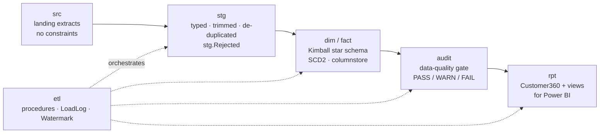

# Architecture & design decisions

The warehouse follows a classic five-stage flow. Every stage is a schema, every schema has a single job,
and nothing outside `etl` writes to the warehouse tables.

## 1. Source layer (`src`)

Six landing tables mirror what a core-banking system typically exports: customers, branches, products,
accounts, transactions and complaints. They have **no constraints on purpose** — a landing zone must
accept whatever the source sends, including the bad rows. `02_generate_source_data.sql` fills them with
a deterministic synthetic dataset and plants the defects listed below so the downstream logic is exercised:

| Planted defect | Rows | Caught by |
|---|---|---|
| Exact duplicate customer rows (extract re-sent) | 50 | `ROW_NUMBER()` de-dup in `usp_StageCustomers` |
| Newer customer versions (changed city, later `UpdatedAt`) | 30 | de-dup keeps the latest; later becomes an SCD2 change |
| Customers with NULL CustomerID | 10 | rejected: *NULL CustomerID* |
| Dirty text — lower-/upper-case or padded cities (~16 %), mixed gender codes `M`/`Male` (~15 %) | thousands | `TRIM`, proper-case, conforming CASE expressions |
| Orphan accounts (customer does not exist) | 25 | rejected: *Orphan CustomerID* |
| Duplicate account rows | 40 | de-dup |
| Duplicate transaction rows (re-sent batch) | 500 | rejected: *Duplicate TransactionID in extract* |
| Future-dated transactions | 100 | rejected: *TxnDate after as-of date* / *TxnDate after CreatedAt* |
| Transactions with NULL AccountID / NULL Amount | 50 / 20 | rejected |
| Orphan transactions (unknown account) | 40 | rejected: *Orphan AccountID* |
| Hidden attriters — customers whose activity stops on a `StopDate` | ~12 % | found by the churn logic (not a defect, the analytical target) |

The generator is **set-based**: a 2²⁰-row tally table (`etl.Numbers`) drives every insert, and
`etl.fn_Rnd(salt, n)` returns a pseudo-random value in `[0,1)` from `HASHBYTES('MD5', salt:n)`.
No loops, no `RAND()`, no `NEWID()` — the same data on every machine, so the tests can assert exact counts.

## 2. Staging layer (`stg`)

Staging turns raw text into typed, conformed rows and quarantines everything else in `stg.Rejected`
(with the reason and the original row as JSON via `FOR JSON PATH`). Key patterns:

* `TRY_CONVERT` for typing — a bad date becomes NULL and is rejected, never a failed batch.
* `ROW_NUMBER() OVER (PARTITION BY business key ORDER BY UpdatedAt DESC)` to keep the latest version.
* `HASHBYTES('SHA2_256', CONCAT_WS('|', …))` as a **row hash** so the dimension loads can detect changes
  without comparing 12 columns.
* Transactions are staged **incrementally**: rows with `CreatedAt > watermark − 1 hour`. The look-back
  absorbs late-arriving rows; duplicates are removed by an anti-join against the fact on `TransactionID`.

## 3. Warehouse layer (`dim`, `fact`)

A Kimball star schema. Design choices:

* **Surrogate keys everywhere**, business keys kept as attributes. Every dimension has an *unknown member*
  with key `-1`, inserted with `SET IDENTITY_INSERT`, so fact rows never need nullable foreign keys.
* **`dim.Customer` is SCD Type 2.** Columns `ValidFrom`, `ValidTo`, `IsCurrent`, `RowHash`; a filtered
  unique index `WHERE IsCurrent = 1` guarantees one current row per customer; a CHECK constraint enforces
  `ValidFrom < ValidTo`. The load uses `MERGE … WHEN MATCHED AND tgt.RowHash <> src.RowHash THEN UPDATE
  (expire) … WHEN NOT MATCHED THEN INSERT`, captures `$action` and the source columns with `OUTPUT … INTO`
  a table variable, then inserts the new versions in a second statement. (Nesting the `MERGE` in an
  `INSERT … SELECT` is disallowed when the target has CHECK constraints — hence the two-step pattern.)
* **`dim.Account` is SCD Type 1** — status changes overwrite, and `IsOpen` is a persisted computed column.
* **`fact.Transaction`** is the grain "one row per posted transaction". It carries the **SCD2 version of
  the customer that was valid on the transaction date** (`ValidFrom <= TxnDate < ValidTo`), which is what
  makes "churn by segment *at the time*" answerable. It has a clustered **columnstore** index for scan-heavy
  analytics plus a unique non-clustered index on `TransactionID` for the idempotent anti-join.
* **`fact.AccountMonthSnapshot`** is a periodic snapshot (grain: account × month). Opening and closing
  balances are running sums with `SUM() OVER (ORDER BY MonthKey ROWS UNBOUNDED PRECEDING)`; `LastTxnDate` and
  `DaysSinceLastTxn` use `MAX() OVER` with the same frame; `IsDormant3M` flags 3 consecutive quiet months.
  Because the synthetic source has no opening-balance feed, balances are relative to the start of the
  loaded history — stated in the column comments and in the README.
* **`fact.Complaint`** is an accumulating snapshot: `OpenedDateKey`, `ClosedDateKey`, `ResolutionDays`,
  loaded with an upsert `MERGE` so status changes flow through.
* **`dim.Date`** covers 2015–2027 with an Egyptian weekend flag (Friday/Saturday) and a July–June fiscal year.

## 4. Quality gate (`audit`)

`etl.usp_RunDataQuality` runs 13 checks after every load and writes one row per check to
`audit.DataQualityResult`. Checks have a severity: **FAIL** checks (uniqueness of the current SCD2 row,
contiguous validity ranges, unresolved keys, source-to-fact reconciliation of counts *and* amounts, future
dates, referential integrity to `dim.Date`, balance reconciliation, one Customer 360 row per customer)
abort the load with `THROW 50001` when `@FailOnDQ = 1`; **WARN** and **INFO** checks are recorded for
monitoring (reject ratio, customers without an open account, negative deposit positions, ageing complaints).

## 5. Serving layer (`rpt`)

`rpt.Customer360` is the one-row-per-customer table Power BI reads: tenure, product holdings and
flags, deposit balance, monthly transaction and spend averages, digital share, recency, complaints,
**RFM scores** (`NTILE(5)` on recency, frequency and monetary value) with a named segment
(Champions, Loyal, New, At Risk, Hibernating, …), the **churn flag** (no transaction in the last 90 days on an
open relationship) and a **risk band** with human-readable reasons built with `STRING_AGG`
("inactive 45 days; 1 open complaint(s); single product"). Eight views expose the star for the report:
transaction detail, monthly KPIs, churn by segment, product penetration, branch performance, customer SCD
history, latest data-quality results and load runs.

## Operations

* Every procedure runs under `SET XACT_ABORT ON` in a `TRY/CATCH` with an explicit transaction; on error
  it rolls back, writes the error to `etl.LoadLog` and re-throws (`THROW`) so the orchestrator stops.
* `etl.usp_RunFullLoad @Mode = 'Full' | 'Incremental'` is the single entry point. Full truncates the
  facts and resets the watermark; Incremental loads deltas only. Both are idempotent — the test harness
  re-runs the incremental load and asserts zero new fact rows and zero new SCD2 versions.
* `rpt.vw_LoadRuns` shows each step with duration and rows; `rpt.vw_DataQualityLatest` the last gate.

## What I would add for production

* Partition `fact.Transaction` by month and switch partitions on load.
* Move orchestration to SQL Agent / Azure Data Factory / Fabric pipelines; keep the T-SQL procedures.
* Replace the hourly look-back with change tracking / CDC on the source.
* Row-level security on `rpt.*` by branch or region for the report.
