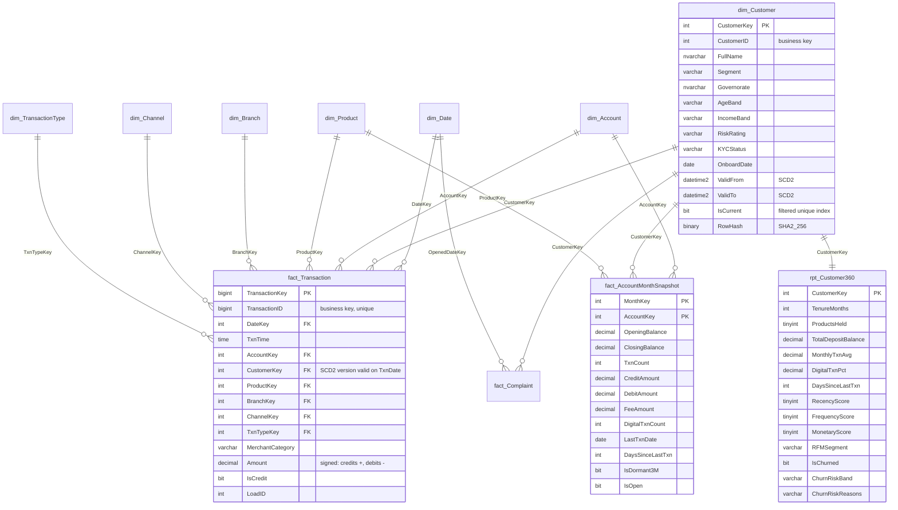

# Data model

## Star schema

## Grain statements

| Table | Grain | Type |
|---|---|---|
| `fact.Transaction` | one row per posted transaction | transaction fact, clustered columnstore |
| `fact.AccountMonthSnapshot` | one row per account per calendar month from the account's open month to the as-of month | periodic snapshot |
| `fact.Complaint` | one row per complaint, updated as it progresses | accumulating snapshot |
| `rpt.Customer360` | one row per *current* customer at the snapshot date | serving table, rebuilt every load |

## Column dictionary

### `dim.Customer` (SCD Type 2)

| Column | Type | Notes |
|---|---|---|
| CustomerKey | INT IDENTITY | surrogate key; `-1` = unknown member |
| CustomerID | INT | business key from the core system |
| FullName | NVARCHAR(121) | `TRIM(First) + ' ' + TRIM(Last)` |
| Gender | VARCHAR(6) | conformed to Male / Female / Unknown |
| BirthDate, AgeBand | DATE, VARCHAR(8) | AgeBand derived at load: 18-24, 25-34, 35-44, 45-54, 55-64, 65+, Unknown |
| Segment | VARCHAR(20) | Retail, Affluent, SME, Private |
| City, Governorate | NVARCHAR(60) | cleansed and proper-cased in staging |
| EmploymentStatus, IncomeBand, RiskRating, KYCStatus | VARCHAR | tracked attributes — a change creates a new version |
| OnboardDate | DATE | relationship start |
| ValidFrom, ValidTo | DATETIME2(0) | version validity; current row has `ValidTo = 9999-12-31`; CHECK `ValidFrom < ValidTo` |
| IsCurrent | BIT | filtered unique index `(CustomerID) WHERE IsCurrent = 1` |
| RowHash | BINARY(32) | SHA2_256 of the tracked attributes — change detection |
| LoadID | INT | `etl.LoadLog` reference |

### `dim.Account` (SCD Type 1)

| Column | Type | Notes |
|---|---|---|
| AccountKey | INT IDENTITY | surrogate |
| AccountID, AccountNo | INT, VARCHAR(20) | business keys |
| CustomerID | INT | owner (business key; the fact resolves the SCD2 CustomerKey per transaction) |
| ProductKey, BranchKey | INT | conformed dimension keys |
| Currency | CHAR(3) | EGP, a few USD savings accounts |
| OpenDate, CloseDate, Status | DATE, DATE, VARCHAR(12) | Active, Dormant, Closed, Frozen |
| IsOpen | BIT (persisted computed) | `Status IN ('Active','Dormant','Frozen')` |
| CreditLimit | DECIMAL(14,2) | cards and overdrafts |

### `dim.Product`, `dim.Branch`, `dim.Channel`, `dim.TransactionType`

Small conformed dimensions. Product and Branch are loaded from the reference extracts; Channel and
TransactionType are seeded inline. `dim.Channel` has Mobile and Internet (`IsDigital = 1`), ATM and POS
(self-service), Branch and CallCenter (assisted) and System — `IsDigital` drives every "digital share"
measure. `dim.TransactionType` carries Salary, Deposit, TransferIn, Interest (credits) and CardPurchase,
ATMWithdrawal, TransferOut, BillPayment, Fee, LoanInstalment (debits), with `Direction`, `TxnGroup` and
`IsRevenueForBank` (Fee, LoanInstalment). `dim.Product.IsLiability` separates deposits from loans and cards.

### `dim.Date`

2015-01-01 … 2027-12-31. `DateKey = yyyymmdd`, `MonthKey = yyyymm`, `IsWeekend` = Friday/Saturday,
`FiscalYear` starts 1 July (FY named after the year it ends in), `IsLastDayOfMonth` for month-end joins.

### `fact.Transaction`

| Column | Type | Notes |
|---|---|---|
| TransactionKey | BIGINT IDENTITY | surrogate |
| TransactionID | BIGINT | business key; unique non-clustered index enables idempotent loads |
| DateKey, TxnTime | INT, TIME(0) | posting date / time |
| AccountKey, CustomerKey, ProductKey, BranchKey, ChannelKey, TxnTypeKey | INT | surrogate keys; CustomerKey is the SCD2 version valid on the transaction date |
| MerchantCategory | VARCHAR(20) | card spend only (Grocery, Fuel, Dining, …) |
| Amount | DECIMAL(14,2) | signed: credits positive, debits negative |
| IsCredit | BIT | stored (computed columns are not allowed with clustered columnstore) |

### `fact.AccountMonthSnapshot`

OpeningBalance / ClosingBalance are cumulative sums of `Amount` up to the previous / current month end
(relative to the start of loaded history). TxnCount, CreditAmount, DebitAmount, FeeAmount and
DigitalTxnCount are the month's activity. LastTxnDate / DaysSinceLastTxn are as of month end;
IsDormant3M = no transactions in this and the two preceding months; IsOpen = account open at month end.

### `rpt.Customer360`

| Group | Columns |
|---|---|
| Identity | CustomerKey, CustomerID, FullName, Segment, Governorate, AgeBand, IncomeBand |
| Tenure | TenureMonths, TenureBand (<1 yr, 1-3 yrs, 3-6 yrs, 6+ yrs) |
| Holdings | ProductsHeld, HasCurrent, HasSavings, HasFixedDeposit, HasCreditCard, HasLoan |
| Money & activity | TotalDepositBalance, MonthlyTxnAvg, MonthlySpendAvg, DigitalTxnPct, LastTxnDate, DaysSinceLastTxn |
| Service | ComplaintsLast12M, OpenComplaints |
| RFM | RecencyScore, FrequencyScore, MonetaryScore (1–5 quintiles), RFMSegment |
| Churn | IsChurned (no transaction for 90+ days on an open, loan-free relationship), ChurnRiskBand (Low / Medium / High), ChurnRiskReasons |
| Lineage | SnapshotDate, RefreshedAt |

### Support tables

* `stg.Rejected` — LoadID, SourceTable, SourceKey, Reason, RowPayload (JSON), RejectedAt.
* `audit.DataQualityResult` — LoadID, CheckName, Severity, Status, Observed, Expected, Details, CheckedAt.
* `etl.LoadLog` — LogID, LoadID, StepName, StartedAt, EndedAt, RowsInserted, RowsUpdated, RowsRejected, Status (Running / Succeeded / Failed), ErrorMessage.
* `etl.Watermark` — TableName, LastLoadedValue (max `CreatedAt` loaded), LastLoadID, UpdatedAt.
* `test.Results` — ResultID, RunID, TestName, Passed, Details, TestedAt.
